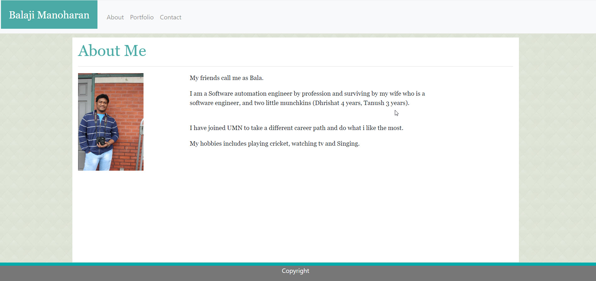
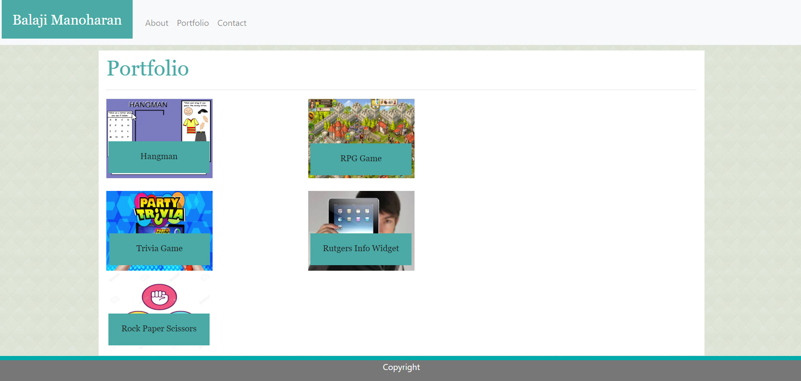
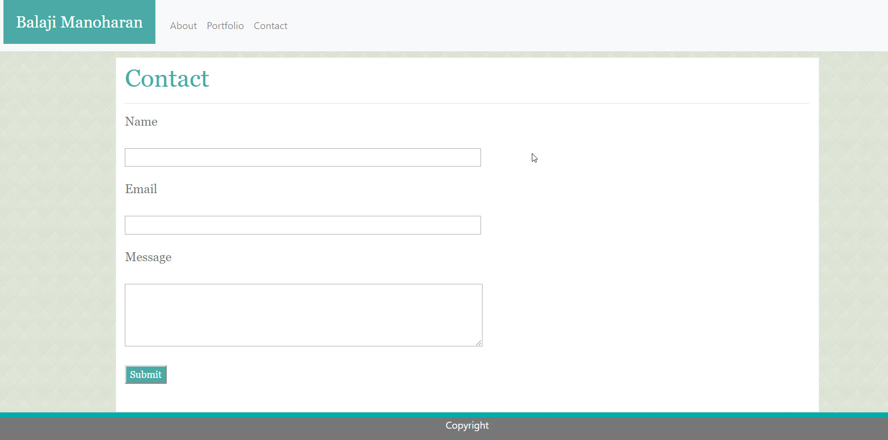

# Homework2

# Project Title
Portfolio - This project covers the portfolio of Balaji Manoharan which was created using Bootstrap. It contains three different sections. It also has responsive design for a better user experience. 
> About Me  
> Portfolio  
> Contact  

# Built With
>Html - UI features  
>CSS - Style sheet  
>Bootstrap and Media Queries  

# Versioning 
> Github

# Screenshots

# About me

# Portfolio

# Contact

# Repo Details 
https://github.com/baredh821/Homework2

# Github Pages
https://baredh821.github.io/Homework2/

